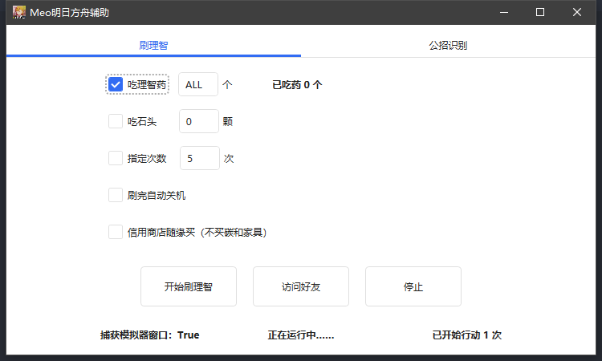
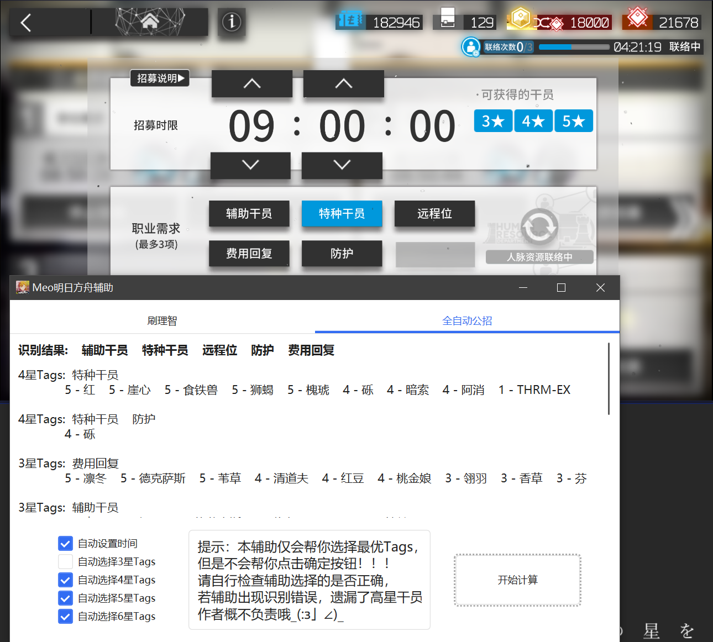
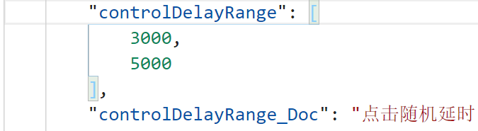

# MeoAssistance

A game assistance for Arknights

一款明日方舟的游戏辅助，供PC端安卓模拟器使用，也勉强兼容安卓手机，龟速开发中……

## 下载地址

[稳定版](https://github.com/MistEO/MeoAssistance/releases/latest)  
[测试版](https://github.com/MistEO/MeoAssistance/releases)

## 功能介绍

- 自动刷理智
    - 可设置是否吃完理智药及数量
    - 可设置是否吃石头及数量
    - 可设置刷的次数（用来刷剿灭啥的）
    - 可设置刷完自动关机
    - 支持剿灭模式
    - 支持打完升级了的情况
    - 支持代理失败的情况，会自动放弃本次行动
    - 支持每次刷完自动截图
    - 支持掉线后重连，继续刷上次的图
    - 支持凌晨4点更新后重连，继续刷上次的图
- 全自动公开招募
    - 自动识别当前招募页所有Tags
    - 自动计算可能出的干员组合并显示
    - 自动帮你点击最优解Tags
    - 自动帮你点击时间9小时
    - 出5、6星干员弹窗提示
    - 最新版本已支持夏活新增的`煌`、`灰喉`等干员
    - 不会帮你点击确定按钮！！！请自行检查辅助选择的是否正确，若出现识别错误，遗漏了高星干员，作者概不负责哦__(:з」∠)_
- 自动访问好友基建
    - 访问完了还会贴心的帮你点进信用商店~
    - 可设置访问完自动买信用商店的材料
- 其他优势
    - 所有点击操作，都是点击按钮内随机位置，并模拟泊松分布（按钮偏中间位置点的概率大，越往旁边点到的概率越小）
    - 刷理智及基建的点击操作，支持设置随机延时，没有封号风险~
    - 模拟器窗口可以被遮挡、可以最小化、甚至可以老板键隐藏！即使全屏看视频、玩游戏，也完全不影响辅助运行
    - 软件支持自动更新✿✿ヽ(°▽°)ノ✿
- 支持多款主流模拟器
- 勉强兼容安卓手机（USB调试、无线调试）
- 自适应分辨率及屏幕缩放
- 未来更多功能见[Todo](#Todo)

### 模拟器支持

#### 蓝叠模拟器

完美支持。需要在模拟器`设置`-`引擎设置`中打开`允许ADB连接`

#### 蓝叠模拟器国际版

完美支持。需要在模拟器`设定`-`进阶`中打开`Android调试桥`

#### 夜神模拟器

完美支持

#### MuMu模拟器

支持

#### 雷电模拟器

支持

#### 逍遥模拟器

支持

#### 腾讯手游助手

不支持，新版本的腾讯好像也是自研引擎了，没开放ADB端口。但是测试是能响应Win32 Api的，有需求再做

#### MuMu手游助手（星云引擎）  

不支持，星云引擎这个版本不支持adb控制，甚至不响应Win32 Api鼠标消息，无解_(:з」∠)_

#### 其他模拟器

若有其他需要，欢迎给我提[ISSUE](https://github.com/MistEO/MeoAssistance/issues)，会根据情况尽量适配~

#### 安卓手机/平板

部分功能支持，正在开发中……  
需要下载[谷歌官方ADB](https://dl.google.com/android/repository/platform-tools-latest-windows.zip)，将`platform-tools`文件夹解压到`MeoAsstGui.exe`的同级目录

## 使用说明

### 基本说明

1. 根据上面模拟器支持情况，进行对应的`ADB`相关操作
2. 解压压缩包，到**没有中文或特殊符号**的文件夹路径
3. 第一次运行辅助，**请使用管理员权限**打开`MeoAsstGui.exe`。运行过一次后，后续不再需要管理员权限（之后的版本会尝试完全去掉管理员权限）
4. 运行期间，模拟器窗口可以最小化，全屏玩游戏、看视频等，完全不影响

### 刷理智

1. 明日方舟打开**蓝色开始行动按钮**的界面
2. 根据你的需要勾选"吃理智药"和"吃石头"
3. 点击"开始刷理智"，开始后上面的选项也可以随时修改
4. 刷完了会自动停止的

### 公开招募识别

1. 明日方舟打开公开招募，有Tag选择的界面
2. 辅助勾选你需要的选项，点击"开始识别"
3. 请检查识别结果是否正确，自行判断是否确定开始招募

再次强调，本辅助仅会帮你选择最优Tags和时间，不会帮你点击确定按钮！！！请自行检查辅助选择的是否正确，若出现识别错误，遗漏了高星干员，作者概不负责哦__(:з」∠)_

### 访问好友基建

1. 明日方舟处于任意界面均可，会自动帮你点过去
2. 根据需要勾选`信用商店随缘买`，点击"访问好友"
3. 达到10次上限，或者所有可访问的好友都访问完了，就会自动停的
4. 然后会贴心的帮你跳转到信用商店，顺便收了当天信用~
5. 信用商店随缘买，就是从左到右依次买，但不会买`碳`和`家具零件`

### 不使用模拟器，而是USB连接安卓手机

1. 下载[ADB程序](https://dl.google.com/android/repository/platform-tools-latest-windows.zip)，将`platform-tools`文件夹解压到`MeoAsstGui.exe`的同级目录
2. 使用USB有线连接安卓手机和电脑
3. 请在手机`设置`-`开发者选项`中打开`USB调试`、`USB调试（安全设置）`两个选项。具体操作方式不同品牌手机各不相同，请自行百度查询
4. 请手动修改`resource\config.json`文件中，`options`.`connectType`为`1`。文件保存后请重新打开程序
5. 当前仅兼容刷理智、公招计算功能，且公招计算暂时无法设置时间

### 不使用模拟器，而是无线连接安卓手机

1. 下载[ADB程序](https://dl.google.com/android/repository/platform-tools-latest-windows.zip)，将`platform-tools`文件夹解压到`MeoAsstGui.exe`的同级目录
2. 请保证安卓手机和电脑处于同一局域网中
3. 请在手机`设置`-`开发者选项`中打开`USB调试`、`USB调试（安全设置）`、`无线调试`三个选项。具体操作方式不同品牌手机各不相同，请自行百度查询
4. 请手动修改`resource\config.json`文件中，`options`.`connectType`为`2`
5. 请手动修改`resource\config.json`文件中，`options`.`connectRemoteAddress`为无线调试的IP地址和端口号。文件保存后请重新打开程序
6. 当前仅兼容刷理智、公招计算功能，且公招计算暂时无法设置时间

**警告：`无线调试`是非常危险的选项，若局域网中存在其他攻击性设备或程序，可能导致手机数据泄露或丢失，请勿在公共的WLAN中使用该功能！**

### 设置操作延时

刷理智、访问基建时，每次点击之前，均随机延时一定的时间，降低封号风险  
该功能默认是关闭的，需要的话请手动打开：请手动修改`resource\config.json`文件中，`options`.`controlDelayRange`字段的值，格式为`[最小延时, 最大延时]`，单位为毫秒，例如想设置3~5秒的随机延时，即设置为`[ 3000, 5000]` 即可。文件保存后请重新打开程序。

### 自动截图功能

每次刷完结算界面，会自动截一张图，保存在`screenshot`文件夹中  
该功能默认是打开的，不需要的话可以手动关掉：请手动修改`resource\config.json`文件中，`options`.`printWindow`字段的值，`true`是打开，`false`是关闭。文件保存后请重新打开程序。

## Todo

- [ ] 彻底去掉管理员权限
- [x] 支持设置吃理智药数量
- [x] 信用商店`看着买`功能
- [x] 支持所有主流模拟器
- [ ] 基建智能换班功能
    - [ ] 图形化界面
    - [x] 干员及精英化识别
    - [ ] 干员识别准确率提高到100%
    - [x] 宿舍心情识别及入驻
    - [x] 制造站、贸易站智能换班
    - [x] 发电站、办公室换班
    - [x] 使用无人机
    - [ ] 控制中枢智能换班
    - [ ] 会客室智能换班
    - [ ] 会客室智能线索交流
    - [ ] 支持`迷迭香`等复杂基建体系
    - [ ] `激进换班模式`
    - [ ] 自定义换班（手动修改配置文件）
- [ ] 使用GPU进行识别的版本
- [ ] 关卡掉落识别
- [ ] 企鹅物流上传
- [ ] `config`中部分选项做成图形化界面
- [x] 图形化界面部分控件状态保存
- [x] 支持掉线重连，继续刷理智
- [x] 支持凌晨4点更新后重连，继续刷理智
- [x] 支持连安卓手机
- [ ] 进一步的异形屏支持
- [x] 后台自动更新
- [x] 忽略当前版本更新
- [ ] 提供log接口，以及界面log

## 致谢

### 开源库

- 图像识别库：[opencv](https://github.com/opencv/opencv.git)
- 文字识别库：[chineseocr_lite](https://github.com/DayBreak-u/chineseocr_lite.git)
- C++ JSON库：[meojson](https://github.com/MistEO/meojson.git)
- WPF MVVW框架：[Stylet](https://github.com/canton7/Stylet)
- WPF控件库：[HandyControl](https://github.com/HandyOrg/HandyControl)
- C# JSON库: [Newtonsoft.Json](https://github.com/JamesNK/Newtonsoft.Json)

### 贡献/参与者

- 非常感谢 [tcyh035](https://github.com/tcyh035) 帮忙设计重构图形界面
- 非常感谢 [GengGode](https://github.com/GengGode) 和 [DbgDebug](https://github.com/DbgDebug) 提供图像算法思路并协助验证
- 非常感谢 [LoveLoliii](https://github.com/LoveLoliii) 提供公开招募算法及数据、部分功能逻辑思路
- 感谢参与软件测试、提bug的小伙伴们~
- ~~感谢[B站直播间](https://live.bilibili.com/2808861)的小伙伴们陪我弹幕吹水~~

## 广告

[B站直播间](https://live.bilibili.com/2808861)：每晚直播敲代码，近期很长一段时间应该都是在写本辅助软件  
[QQ群](https://jq.qq.com/?_wv=1027&k=ypbzXcA2)：直播间关联Q群，欢迎加入~
