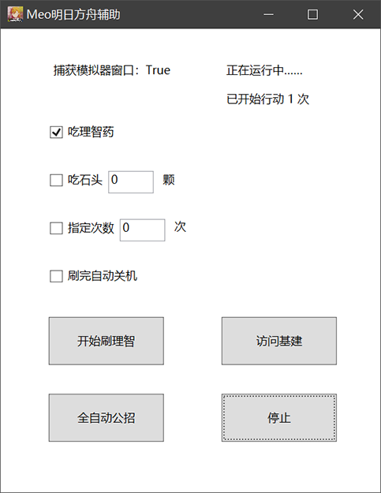
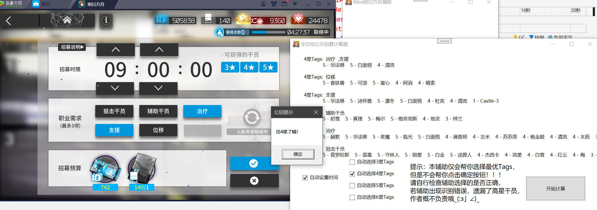
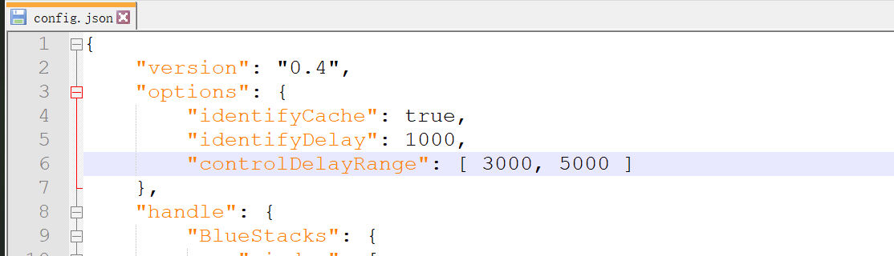
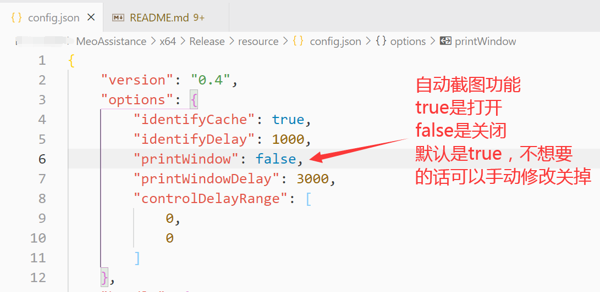

# MeoAssistance

A game assistance for Arknights

一款明日方舟的游戏辅助，供PC端安卓模拟器使用，龟速开发中……

## 下载地址
[稳定版](https://github.com/MistEO/MeoAssistance/releases/latest)  
[测试版](https://github.com/MistEO/MeoAssistance/releases)

## 功能介绍

- 自动刷理智
    - 可设置是否吃完理智药
    - 可设置是否吃石头以及数量
    - 可设置刷的次数（可以用来刷剿灭）
    - 可设置刷完自动关机
    - 支持剿灭模式
    - 支持打完升级了的情况
    - 支持代理失败的情况，会自动放弃本次行动
    - 支持每次刷完自动截图，可用于上传企鹅物流~
- 全自动公开招募（新功能！）
    - 自动识别当前招募页所有Tags
    - 自动计算可能出的干员组合并显示
    - 自动帮你点击最优解Tags
    - 自动帮你点击时间9小时
    - 出4、5、6星干员弹窗提示
    - 最新版本已支持夏活新增的煌、灰喉等干员
    - 不会帮你点击确定按钮！！！请自行检查辅助选择的是否正确，若出现识别错误，遗漏了高星干员，作者概不负责哦__(:з」∠)_
- 自动访问好友基建
    - 访问完了还会贴心的帮你点进信用商店~
- 其他优势
    - 所有操作，都是点击按钮内随机位置，且支持设置随机延时，没有封号风险
    - 模拟器窗口可以被遮挡，即使全屏看视频、玩游戏，也不影响辅助运行（但模拟器窗口不能最小化）
- 支持多款主流模拟器
- 自适应分辨率及屏幕缩放
- 未来更多功能见[Todo](#Todo)

### 模拟器支持

#### 蓝叠模拟器

完美支持，作者绝大部分测试均在蓝叠上进行，稳定性最能保障

#### MuMu模拟器

完美支持，专门单独做了一套基于adb的控制逻辑。需要关闭模拟器的底部工具栏（快捷键Alt+T）

#### MuMu手游助手（星云引擎）  

不支持，MuMu不响应SendMessage鼠标消息，而且这个版本不支持adb控制，正在想办法……

#### 逍遥模拟器

支持，需要收起右侧侧边栏后使用，未多做测试

#### 雷电模拟器

支持，需要收起右侧侧边栏后使用，未多做测试

#### 夜神模拟器

支持，效果不太好，且辅助开始后不可移动模拟器窗口，不推荐使用

#### 腾讯手游助手

不支持，腾讯不支持句柄的窗口尺寸调节，有人需要的话再单独做

#### 其他

若需要使用其他模拟器、或上述不兼容的模拟器。欢迎给我提[ISSUE](https://github.com/MistEO/MeoAssistance/issues)，会根据情况尽量适配~

## 使用说明

### 基本说明

1. 使用支持的模拟器打开明日方舟
2. 解压压缩包，**使用管理员权限**，打开"MeoAsstGui.exe"
3. 运行期间，模拟器窗口可以被遮挡，全屏玩游戏、看视频等，完全不影响，但是模拟器不能最小化（其实也没事，辅助会帮你把模拟器窗口强行弹回来。。）
4. 若需要长时间挂机，请关闭电脑的息屏、睡眠等功能

### 刷理智

1. 明日方舟打开**蓝色开始按钮**的界面
2. 根据你的需要勾选"吃理智药"和"吃石头"
3. 点击"开始刷理智"，开始后上面的选项也可以随时修改
4. 刷完了会自动停止的

### 全自动公开招募（新功能！）

1. 明日方舟打开公开招募，有Tag选择的界面
2. 辅助勾选你需要的选项，点击"开始计算"
3. 请检查识别结果是否正确，自行判断是否确定开始招募

再次强调，本辅助仅会帮你选择最优Tags和时间，不会帮你点击确定按钮！！！请自行检查辅助选择的是否正确，若出现识别错误，遗漏了高星干员，作者概不负责哦__(:з」∠)_

### 访问好友基建

1. 明日方舟处于任意界面均可，会自动帮你点过去
2. 点击"访问基建"
3. 达到10次上限，或者所有可访问的好友都访问完了，就会自动停的
4. 然后会贴心的帮你跳转到信用商店，顺便收了当天信用~

### 设置操作延时

刷理智、访问基建时，每次点击之前，均随机延时一定的时间，降低封号风险  
该功能默认是关闭的，需要的话请手动打开：请手动修改`resource\config.json`文件中，`options`.`controlDelayRange`字段的值，格式为`[最小延时, 最大延时]`，单位为毫秒，例如想设置3~5秒的随机延时，即设置为`[ 3000, 5000]` 即可。文件保存后请重新打开程序。

### 自动截图功能

每次刷完结算界面，会自动截一张图，保存在`screenshot`文件夹中  
该功能默认是打开的，不需要的话可以手动关掉：请手动修改`resource\config.json`文件中，`options`.`printWindow`字段的值，`true`是打开，`false`是关闭。文件保存后请重新打开程序。

## Todo

~~在做了在做了.jpg~~

- [ ] 功能
    - [ ] 图形化界面
        - [x] 基本图形化界面
        - [ ] 图形化界面进一步完善
        - [ ] 日志打印，错误提示
        - [x] 刷完自动关机功能
		- [ ] ~~操作随机延时支持设置~~
    - [ ] 刷理智
        - [x] 支持剿灭
        - [x] 支持使模拟器窗口不可见
        - [x] 自动吃体力药
        - [x] 代理失败的情况
        - [x] 支持等级提升
        - [x] 支持自动勾选代理指挥
        - [x] 支持刷指定次数
        - [x] 自动吃石头（根据设置，指定数量）
		- [x] 操作随机延时
        - [ ] 指定刷XX个某材料
        - [ ] 支持凌晨4点更新数据
        - [x] 结束界面自动截图，可用于上传企鹅物流
        - [ ] 持续监视理智，一有就自动刷掉
        - [x] 模拟器被最小化了，给出提示
    - [x] 支持更多模拟器
    - [x] 信用访问
    - [ ] 基建收菜
    - [ ] 基建自动换班
    - [ ] 全自动公招
        - [ ] 任务队列优化
        - [ ] 界面优化
        - [ ] 干员自动更新
- [x] 算法
    - [x] 更换算法为模板匹配找图，而不是当前的区域相似度对比
    - [x] 优化算法效率，添加缓存功能
    - [x] 优化任务队列，减少不必要的计算
    - [ ] 掉落材料计数
    - [ ] ~~窗口分辨率自适应，针对MuMu、腾讯模拟器进一步适配~~
    - [ ] 重构任务队列
- [x] 其他
    - [x] 尝试减小程序体积
    - [x] 检查程序更新
    - [ ] 程序自动更新

## 致谢

感谢以下开源库

- [opencv](https://github.com/opencv/opencv.git)
- [chineseocr_lite](https://github.com/DayBreak-u/chineseocr_lite.git)
- [meojson](https://github.com/MistEO/meojson.git)
