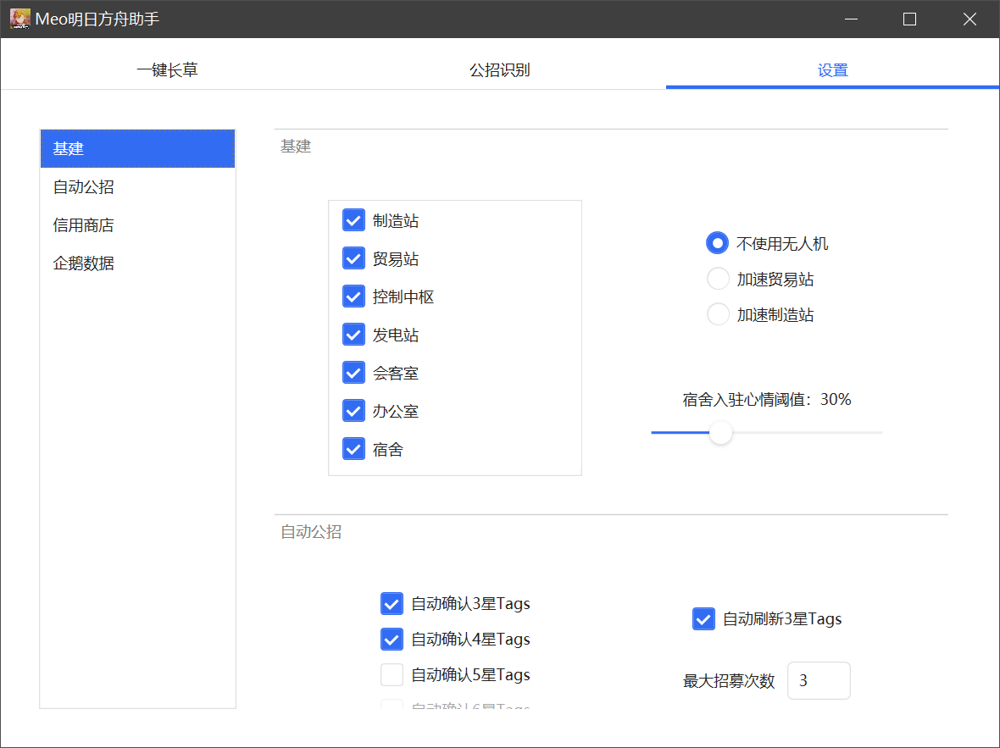
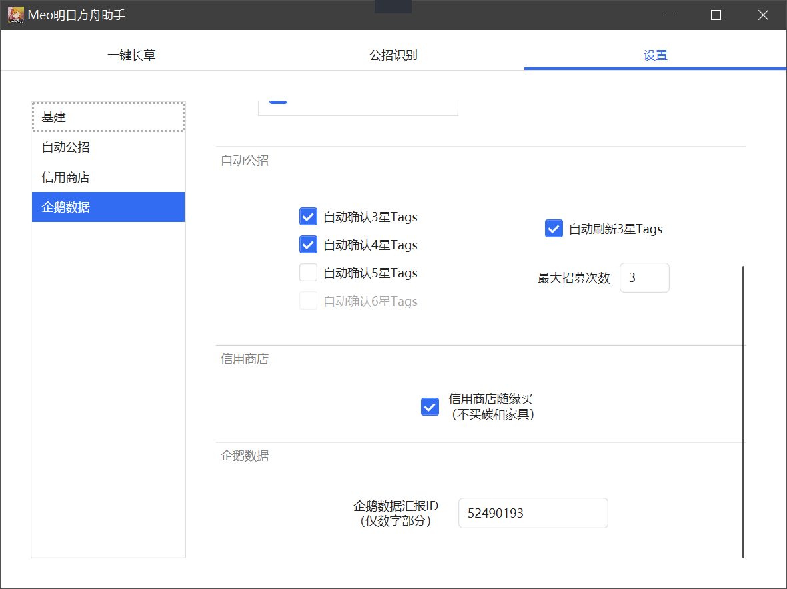

# MeoAssistantArknights

 

    
    

    

    
    
    

 

A Game Assistant for Arknights

一款明日方舟的游戏小助手，一键完成所有日常，全自动长草！！！

纯图像识别，非内存挂！全图形化界面，开罐即食！

并提供 [Python接口](src/Python/interface.py) 供自行DIY~ 绝赞更新中！✿✿ヽ(°▽°)ノ✿  

## 功能介绍

废话不多说，看图！

## 下载地址

[稳定版](https://github.com/MistEO/MeoAssistantArknights/releases/latest)  
[测试版](https://github.com/MistEO/MeoAssistantArknights/releases)

## 模拟器支持

### 蓝叠模拟器

完美支持。需要在模拟器`设置`-`引擎设置`中打开`允许ADB连接`

### 蓝叠模拟器国际版

完美支持。需要在模拟器`设定`-`进阶`中打开`Android调试桥`

### 夜神模拟器

完美支持

### MuMu模拟器

完美支持

### 雷电模拟器

勉强支持。雷电总有莫名其妙的问题，可以试试看，不保证能用（

### 逍遥模拟器

支持

### 腾讯手游助手

不支持。新版本的腾讯好像也是自研引擎了，没开放ADB端口；但是测试是能响应Win32 Api的，有需求再做

### MuMu手游助手（星云引擎）  

不支持。星云引擎这个版本不支持adb控制，甚至不响应Win32 Api鼠标消息，无解_(:з」∠)_

### Win11 WSA

不支持，WSA 目前没有实现 AOSP screencap 需要的接口，无法进行截图。等微软支持后会尝试适配

### 蓝叠模拟器Hyper-V版本

支持

1. 在模拟器`设定`-`进阶`中打开`Android调试桥`
2. 下载 [ADB](https://dl.google.com/android/repository/platform-tools-latest-windows.zip) ，将`platform-tools`文件夹解压到`MeoAsstGui.exe`的同级目录
3. 在软件`设置`-`连接设置`中填写蓝叠安装目录下`bluestacks.conf`文件的完整路径

### 自定义连接

- 下载 [ADB](https://dl.google.com/android/repository/platform-tools-latest-windows.zip) ，将`platform-tools`文件夹解压到`MeoAsstGui.exe`的同级目录
- 进入软件`设置`-`连接设置`，填写自定义地址（需要填写IP+端口，例如`127.0.0.1:5555`）
- **注意 :** 若是使用手机，在非`16:9`分辨率下，部分功能不稳定（但也凑合能用），尤其是基建，几乎是不可用状态，正在进一步适配中。推荐使用`16:9`分辨率，经过的测试验证最多，也最稳定。

## 使用说明

### 基本说明

1. 根据上面模拟器支持情况，进行对应的操作
2. 解压压缩包，到**没有中文或特殊符号**的文件夹路径
3. 第一次运行软件，**请使用管理员权限**打开`MeoAsstGui.exe`。运行过一次后，后续不再需要管理员权限
4. 开始运行后，所有设置均不可再修改

### 刷理智

- 若游戏处于**蓝色开始按钮**界面，则会刷当前关卡。否则会前往上次作战的关卡！
- 主界面上的`吃理智`、`吃石头`、`指定次数`三个选项为短路开关，即三个选项中的任一条件达到，均会视为任务完成，停止刷理智。
    - 举例1：设置`吃理智药`:`999`、`吃石头`:`10`、`指定次数`:`1`。则在刷完**一次**后，由于满足了`指定次数`:`1`的条件，视为任务完成，停止刷理智。
    - 举例2：不勾选`吃理智药`、不勾选`吃石头`，设置`指定次数`:`100`。则在当前可用理智全部刷完后（可能只刷了几次），由于满足了`不吃理智药`、`不吃石头`的条件，视为任务完成，停止刷理智。
- 其他优势
    - 支持刷完自动上传 [企鹅物流数据统计](https://penguin-stats.cn/)
    - 支持企鹅物流自定义ID
    - 支持统计掉落数量
    - 支持剿灭模式
    - 支持打完升级了的情况
    - 支持代理失败的情况，会自动放弃本次行动
    - 支持掉线后重连，继续刷上次的图
    - 支持凌晨4点更新后重连，继续刷上次的图

### 基建换班

#### 换班策略

自动计算并选择**单设施内的最优解**，支持所有通用类技能和特殊技能组合；支持识别经验书、赤金、原石碎片、芯片，分别使用不同的干员组合！

#### 宿舍入驻心情阈值

识别心情进度条的百分比；心情小于该阈值的干员，不会再去上班，直接进驻宿舍

#### 特殊说明

- 基建换班目前均为单设施最优解，但非跨设施的全局最优解。例如：`巫恋 龙舌兰`、`红云 稀音`等这类单设施内的组合，都是可以正常识别并使用的；`迷迭香`、`红松骑士团`这类多个设施间联动的体系，目前都是不支持的
- 会客室仅缺一个线索时，会选择对应流派的干员；否则会选择通用干员
- 会客室暂不支持送出线索，当线索满时可能会处理异常。建议自动换班完成后自己再去看下会客室的情况
- 控制中枢策略太过复杂，目前只考虑`阿米娅`、`诗怀雅`、`凯尔希`、`彩虹小队`及其他心情+0.05的干员，后续逐步优化

### 信用商店随缘买

从左到右依次买，但不会买`碳`和`家具零件`。有需要的同学可自行修改`resource\tasks.json`中`CreditShop-NotToBuy`.`text`字段，自定义不买的物品。后续版本会尝试开放界面选项

### 公开招募识别

- 公招识别和自动公招是两个独立的功能！
- 公招识别需要手动打开有公招Tag选择的界面再使用

### 其他乱七八糟的说明

- 公招出5、6星会有弹窗提示
- 主界面上要执行的任务，是可以拖动改变顺序的。同样设置中基建换班的顺序，也是可以拖动改变的
- 活动关卡掉落识别到的`未知材料`，一般就是活动商店的票据
- 新的活动关卡刚上线的时候可能无法正常识别，一般一两天内软件会自动OTA更新资源，更新后即可正常识别
- 所有点击操作，都是点击按钮内随机位置，并模拟泊松分布（按钮偏中间位置点的概率大，越往旁边点到的概率越小）
- `resource\config.json`中有一些自定义选项，可以尝试根据自己的需要进行修改
- 底层算法纯C++开发，并设计了多重的缓存技术，最大限度降低CPU和内存占用
- 软件支持自动更新✿✿ヽ(°▽°)ノ✿ 推荐非杠精的同学使用测试版，一般来说更新快且bug少（什么MIUI (╯‵□′)╯︵┻━┻

## 常见问题

### 软件一打开就闪退

- 目前初步怀疑是运行库问题。可以尝试把 [Visual C++ Redistributable](https://docs.microsoft.com/sl-SI/cpp/windows/latest-supported-vc-redist?view=msvc-160)、[.NET Framework 4.8](https://dotnet.microsoft.com/download/dotnet-framework/net48) 都安装一下看看有没有效果
- 若您有一定的开发能力，也可使用 [Python接口](src/Python/interface.py) 自行调用

### 连接错误/捕获模拟器窗口错误

- 方法1: 使用 [自定义连接](#自定义连接) 的方式连接模拟器
- 方法2: 换模拟器，推荐 [蓝叠国际版](https://www.bluestacks.com/download.html)
- 方法3: _根本解决方法_ 编辑`resource/config.json`，修改（最好是新增）模拟器窗口句柄名，并修改对应的adb设置。若您修改后可以提PR给我，我会感激不尽的_(:з」∠)_

### 

## Todo

- [x] 任务队列功能
- [ ] 常用关卡选关
- [x] 自动收任务功能
- [x] 基建智能换班功能
    - [x] 图形化界面
    - [x] 干员技能识别
    - [x] 干员识别准确率提高到100%
    - [x] 宿舍心情识别及入驻
    - [x] 制造站、贸易站智能换班
    - [x] 发电站、办公室换班
    - [x] 使用无人机
    - [x] 控制中枢智能换班
    - [x] 会客室智能换班
    - [x] 会客室智能线索交流
    - [ ] 支持`迷迭香`等复杂基建体系
    - [x] `激进换班模式`
    - [ ] 自定义换班（手动修改配置文件）
    - [ ] 宿舍换班支持加速心情的干员识别
    - [x] 贸易站无人机支持设置给经验书还是赤金
- [ ] 使用GPU进行识别的版本
- [x] 企鹅物流汇报，自定义ID
- [ ] 指定刷某种材料xx个
- [ ] `config`中部分选项做成图形化界面
- [x] 界面拖动顺序保存
- [ ] 进一步的异形屏支持
- [x] 后台自动更新
- [x] 忽略当前版本更新
- [ ] 提供log接口，以及界面log
- [ ] 更换OCR库，提高公开招募识别率
- [x] 终极目标！全自动长草机！！！

## 致谢

### 开源库

- 图像识别库：[opencv](https://github.com/opencv/opencv.git)
- ~~文字识别库：[chineseocr_lite](https://github.com/DayBreak-u/chineseocr_lite.git)~~
- 文字识别库：[PaddleOCR](https://github.com/PaddlePaddle/PaddleOCR)
- 关卡掉落识别：[企鹅物流识别](https://github.com/KumoSiunaus/penguin-stats-recognize-v3)
- C++ JSON库：[meojson](https://github.com/MistEO/meojson.git)
- C++ 运算符解析器：[calculator](https://github.com/kimwalisch/calculator)
- C++ base64编解码：[cpp-base64](https://github.com/ReneNyffenegger/cpp-base64)
- WPF MVVW框架：[Stylet](https://github.com/canton7/Stylet)
- WPF控件库：[HandyControl](https://github.com/HandyOrg/HandyControl)
- C# JSON库: [Newtonsoft.Json](https://github.com/JamesNK/Newtonsoft.Json)
- 下载器：[aria2](https://github.com/aria2/aria2)

### 数据源

- 公开招募数据：[明日方舟工具箱](https://www.bigfun.cn/tools/aktools/hr)
- 干员及基建数据：[PRTS明日方舟中文WIKI](http://prts.wiki/)
- 关卡数据：[企鹅物流数据统计](https://penguin-stats.cn/)

### 贡献/参与者

- 非常感谢 [tcyh035](https://github.com/tcyh035) 帮忙设计重构图形界面
- 非常感谢 [GengGode](https://github.com/GengGode) 和 [DbgDebug](https://github.com/DbgDebug) 提供图像算法思路并协助验证
- 非常感谢 [LoveLoliii](https://github.com/LoveLoliii) 提供公开招募算法及数据、部分功能逻辑思路
- 感谢 [内卷地狱](https://jq.qq.com/?_wv=1027&k=ypbzXcA2) 的大佬们提供的各种协助支持
- 感谢 [LmeSzinc](https://github.com/LmeSzinc) 提供的界面样式参考，~~虽然我抄了个四不像orz~~
- 感谢参与软件测试、提bug的小伙伴们~
- ~~感谢 [B站直播间](https://live.bilibili.com/2808861) 的小伙伴们陪我弹幕吹水~~

## 广告

[B站直播间](https://live.bilibili.com/2808861)：每晚直播敲代码，近期很长一段时间应该都是在写本助手软件  
[QQ群：内卷地狱](https://jq.qq.com/?_wv=1027&k=ypbzXcA2)：欢迎加入~  

如果觉得软件对你有帮助，帮忙点个Star吧！~（网页最上方右上角的小星星），这就是对我最大的支持了！

PS：作者前端苦手，现在的界面（WPF）基本是现学现卖的，写得很烂，希望有大佬能帮忙提点PR修改修改，感激不尽_(:з」∠)_
