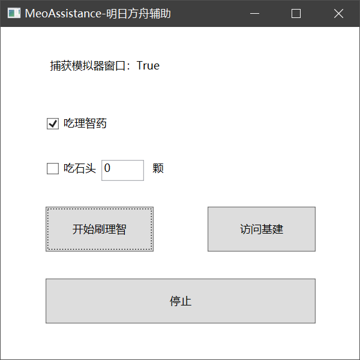

# MeoAssistance

A game assistance for Arknights

一款明日方舟的游戏辅助，供PC端安卓模拟器使用，龟速开发中……

## 功能介绍

- 支持自动刷完理智
- 支持自动吃完体力药
- 支持根据设置自动吃石头
- 刷完后程序会自动停止
- 代理失败会自动放弃本次行动
- 支持自动访问好友基建
- 所有操作，都是点击按钮内随机位置，且模拟泊松分布，不会像鼠标宏一样一直是同一个点，没有封号风险
~~（虽然好像也没听说过谁用鼠标宏被封号的）~~
- 模拟器窗口可以被遮挡，即使全屏看视频、玩游戏，也完全不影响辅助运行
~~（但是模拟器还是不能最小化）~~
- 支持多款主流模拟器
- 自适应分辨率及屏幕缩放
- 未来更多功能见[Todo](#Todo)

### 模拟器支持

#### 蓝叠模拟器

完美兼容，作者绝大部分测试均在蓝叠上进行，稳定性最能保障

#### 逍遥模拟器

完美兼容

#### 雷电模拟器

完美兼容，需要收起右侧侧边栏后使用

#### 夜神模拟器

兼容，但辅助开始后不可操作模拟器窗口

#### 腾讯手游助手

兼容，但需要手动设置分辨率：设置中心——引擎设置——分辨率设置——1280x720——保存后重启模拟器

#### MuMu

MuMu是个奇葩，它的所有的窗口句柄均不响应SendMessage鼠标消息

- MuMu模拟器  
官方提供了adb控制点击操作的方式，本辅助非常勉强的兼容了刷理智的功能，需要在模拟器设置里把分辨率设置成1280x720，而且效果还不一定能保证。建议使用"Sanity.exe"，而不是图形化界面，因为adb控制台窗口会一直往出弹
- MuMu手游助手（星云引擎）  
不兼容，可见未来内也想不到什么好主意来兼容的

## 使用说明

### 基本说明

1. 使用支持的模拟器打开明日方舟
2. 解压压缩包，**使用管理员权限**，打开"MeoAsstGui.exe"
3. 注意：运行期间，模拟器窗口可以被遮挡，全屏玩游戏、看视频等，完全不影响，但是！！模拟器不能最小化！！！

### 刷理智

1. 明日方舟打开**蓝色开始按钮**的界面
1. 根据你的需要勾选"吃理智药"和"吃石头"
2. 点击"开始刷理智"
3. 刷完了会自动停止的

### 访问好友基建

1. 明日方舟处于任意界面均可，会自动帮你点过去
2. 点击"访问基建"
3. 达到10次上限，或者所有可访问的好友都访问完了，就会自动停的

## Todo

~~在做了在做了.jpg~~

- [ ] 功能
    - [ ] 图形化界面
        - [x] 基本图形化界面
        - [ ] 图形化界面进一步完善
        - [ ] 日志打印，错误提示
        - [ ] 使模拟器窗口不可见的按钮
    - [ ] 刷理智
        - [x] 支持剿灭
        - [x] 支持使模拟器窗口不可见
        - [x] 自动吃体力药
        - [x] 代理失败的情况
        - [x] 支持等级提升
        - [x] 支持自动勾选代理指挥
        - [ ] 支持刷指定次数
        - [x] 自动吃石头（根据设置，指定数量）
        - [ ] 支持凌晨4点更新数据
        - [ ] 结束界面自动截图，可用于上传企鹅物流
        - [ ] 持续监视理智，一有就自动刷掉
        - [ ] 模拟器被最小化了，给出提示
    - [x] 支持更多模拟器
    - [x] 信用访问
    - [ ] 基建收菜
    - [ ] 当前公招可能干员一览
- [x] 算法
    - [x] 更换算法为模板匹配找图，而不是当前的区域相似度对比
    - [x] 优化算法效率，添加缓存功能
    - [x] 优化任务队列，减少不必要的计算
    - [ ] 进一步优化任务队列效率
- [x] 其他
    - [x] 尝试减小程序体积

## 致谢

感谢以下开源库/免费API

- WinAPI
- OpenCV
- MeoJson
- WPF
