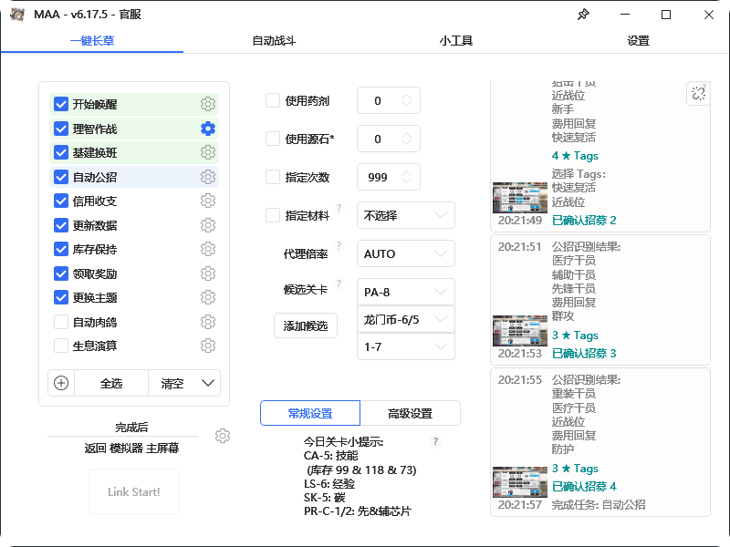
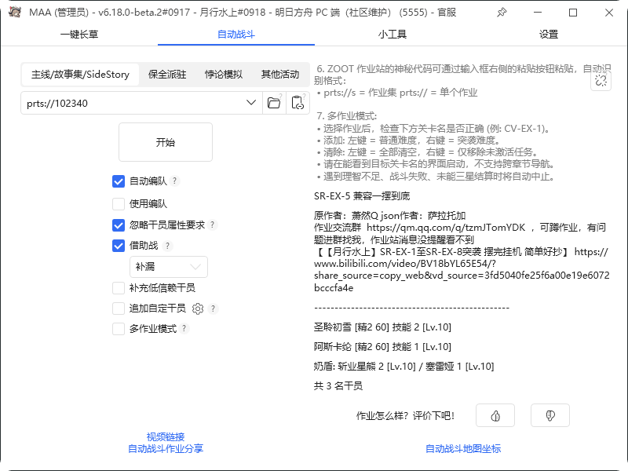
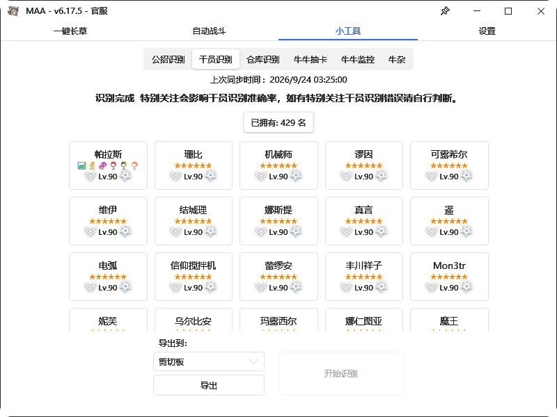
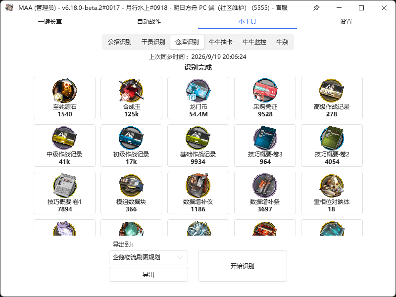

<!-- markdownlint-disable -->

# MAA

 

    
    

    
    

    
    

    

    

 

<!-- markdownlint-restore -->

[Simplified Chinese](https://docs.maa.plus/zh-cn/) | [Traditional Chinese](https://docs.maa.plus/zh-tw/) | [English](https://docs.maa.plus/en-us/) | [Japanese](https://docs.maa.plus/ja-jp/) | [Korean](https://docs.maa.plus/ko-kr/)

MAA stands for MAA Assistant Arknights

A helpful tool for the game Arknights

With image recognition technology, complete all your daily tasks with one click!

Awesome update ✿✿ヽ(°▽°)ノ✿

## Download and Installation

Please read the [Document](https://docs.maa.plus/zh-cn/manual/newbie.html) and then go to the [Official Website](https://maa.plus) or [Releases](https://github.com/MaaAssistantArknights/MaaAssistantArknights/releases) to download and refer to the [Getting Started Guide](https://docs.maa.plus/zh-cn/manual/newbie.html) for installation instructions.

## Highlight Features

- Fight rationally, identify and upload dropped items to [Penguin Logistics](https://penguin-stats.cn/), [One-image summary](https://ark.yituliu.cn/)
- Intelligent infrastructure shift scheduling automatically calculates operator efficiency and finds the optimal solution within a single facility; it also supports [custom scheduling](https://docs.maa.plus/zh-cn/protocol/base-scheduling-schema.html).
- Automated recruitment, with optional expedited license, all recruitment data processed at once! Recruitment data is automatically uploaded to [Penguin Logistics](https://penguin-stats.cn/result/stage/recruit/recruit) and [one-image stream](https://ark.yituliu.cn/survey/maarecruitdata).
- Supports manual identification of the recruitment interface, making it easier to select high-star recruitment slots~~(Did your high-return recruitment pull out either Push King or Push King?)~~
- Supports identifying the operator list, counting existing and non-existent operators and their potential, and displaying this information in the recruitment process.
- Supports identification of training materials and export to [Penguin Logistics Farming Planner](https://penguin-stats.cn/planner), [Arknights Toolbox](https://arkntools.app/#/material), and [ARK-NIGHTS Operator Training Table](https://ark-nights.com/settings).
- Visit friends, collect credits and make purchases, claim daily rewards, etc., all with one click for automatic daily activity growth.
- Fully automated Originium Ingot farming and leveling, automatic water boiling and boosting, intelligent operator recognition and skill level assessment.
- Select the assignment JSON file to automatically copy the assignment. [Video demonstration](https://www.bilibili.com/video/BV1H841177Fk/)
- Supports multiple interfaces including C, Python, Java, Rust, Golang, Java HTTP, and Rust HTTP, facilitating integration and customization of your MAA!

<!-- markdownlint-disable -->

Without further ado, see the pictures!

<picture>
  <source media="(prefers-color-scheme: dark)" srcset="./docs/.vuepress/public/images/zh-cn/readme/1-dark.png">
  
</picture>
<picture>
  <source media="(prefers-color-scheme: dark)" srcset="./docs/.vuepress/public/images/zh-cn/readme/2-dark.png">
  
</picture>
<picture>
  <source media="(prefers-color-scheme: dark)" srcset="./docs/.vuepress/public/images/zh-cn/readme/3-dark.png">
  
</picture>
<picture>
  <source media="(prefers-color-scheme: dark)" srcset="./docs/.vuepress/public/images/zh-cn/readme/4-dark.png">
  
</picture>

<!-- markdownlint-restore -->

## Instructions for Use

### Function Introduction

Please refer to the [User Manual](https://docs.maa.plus/zh-cn/manual/).

### International Server Support

Currently, most features are supported in the international (US), Japanese, Korean, and Traditional Chinese servers. However, due to the smaller number of users on these servers and insufficient manpower, many features have not been fully tested, so please explore them yourself.  
If you encounter any bugs or have a strong need for a particular feature, feel free to request updates in the [Issues](https://github.com/MaaAssistantArknights/MaaAssistantArknights/issues) and [Discussions](https://github.com/MaaAssistantArknights/MaaAssistantArknights/discussions); or join us in building MAA! Please refer to the [Overseas Client Adaptation Tutorial](https://docs.maa.plus/zh-cn/develop/overseas-client-adaptation.html)

### CLI Support

MAA supports command-line interface (CLI) operation on Linux, macOS, and Windows, and can be used for automation scripts or on servers without a graphical interface. Please refer to the [CLI User Guide](https://docs.maa.plus/zh-cn/manual/cli/)

## Join Us

### Main Related Projects

- Brand new framework: [MaaFramework](https://github.com/MaaXYZ/MaaFramework)
- [Homework Station](https://prts.plus) Frontend: [zoot-plus-frontend](https://github.com/ZOOT-Plus/zoot-plus-frontend)
- [Homework Station](https://prts.plus) Backend: [ZootPlusBackend](https://github.com/ZOOT-Plus/ZootPlusBackend)
- [Official Website](https://maa.plus): [Frontend](https://github.com/MaaAssistantArknights/maa-website)
- Deep Learning: [MaaAI](https://github.com/MaaAssistantArknights/MaaAI)

### Multilingual (i18n)

MAA uses Simplified Chinese as its primary language, and all translated entries are based on Simplified Chinese.

### Participation in Development

Please refer to the [Development Guide](https://docs.maa.plus/zh-cn/develop/development.html).

### API

- [C Interface](include/AsstCaller.h): [Integration Example](src/Cpp/main.cpp)
- [Python Interface](src/Python/asst/asst.py): [Integration Example](src/Python/sample.py)
- [Golang Interface](src/Golang): [Integration Example](src/Golang/maa/maa.go)
- [Dart Interface](src/Dart)
- [Java Interface](src/Java/src/main/java/com/iguigui/maaj/easySample/MaaCore.java): [Integration Example](src/Java/src/main/java.com/iguigui/maaj/easySample/MaaJavaSample.java)
- [Java HTTP Interface](src/Java/Readme.md)
- [Rust Interface](src/Rust/src/maa_sys): [HTTP Interface](src/Rust)
- [TypeScript Interface](https://github.com/MaaAssistantArknights/MaaX/tree/main/packages/main/coreLoader)
- [Woolang Interface](src/Woolang/maa.wo): [Integration Example](src/Woolang/demo.wo)
- [Integration Documentation](https://docs.maa.plus/zh-cn/protocol/integration.html)
- [Callback Message Protocol](https://docs.maa.plus/zh-cn/protocol/callback-schema.html)
- [Task Flow Agreement](https://docs.maa.plus/zh-cn/protocol/task-schema.html)
- [Automatic Battle Protocol](https://docs.maa.plus/zh-cn/protocol/copilot-schema.html)

### External Server Compatibility

Please refer to the [Overseas Client Adaptation Tutorial](https://docs.maa.plus/zh-cn/develop/overseas-client-adaptation.html). For most of the features already supported in the Chinese server, the adaptation work for overseas servers only requires screenshots and simple JSON modifications.

### Issue bot

Please refer to [Issue Bot Usage Guide](https://docs.maa.plus/zh-cn/develop/issue-bot-usage.html)

Acknowledgments

### Open Source Libraries

- Image recognition library: [opencv](https://github.com/opencv/opencv.git)
- Text recognition library: [chineseocr_lite](https://github.com/DayBreak-u/chineseocr_lite.git)
- Text recognition library: [PaddleOCR](https://github.com/PaddlePaddle/PaddleOCR)
- Deep learning deployment library: [FastDeploy](https://github.com/PaddlePaddle/FastDeploy)
- Machine learning accelerator: [onnxruntime](https://github.com/microsoft/onnxruntime)
- ~~Level Drop Recognition: [Penguin Logistics Recognition](https://github.com/penguin-statistics/recognizer)~~
- Map grid recognition: [Arknights-Tile-Pos](https://github.com/yuanyan3060/Arknights-Tile-Pos)
- C++ JSON library: [meojson](https://github.com/MistEO/meojson.git)
- C++ operator parser: [calculator](https://github.com/kimwalisch/calculator)
- C++ base64 encoding/decoding: [cpp-base64](https://github.com/ReneNyffenegger/cpp-base64)
- C++ decompression library: [zlib](https://github.com/madler/zlib)
- C++ Gzip wrapper: [gzip-hpp](https://github.com/mapbox/gzip-hpp)
- Android touch event handler: [Minitouch](https://github.com/DeviceFarmer/minitouch)
- Android Touch Event Handler: [MaaTouch](https://github.com/MaaAssistantArknights/MaaTouch)
- WPF MVVM framework: [Stylet](https://github.com/canton7/Stylet)
- WPF control library: [HandyControl](https://github.com/HandyOrg/HandyControl) -> [HandyControls](https://github.com/ghost1372/HandyControls)
- C# Log: [Serilog](https://github.com/serilog/serilog)
- C# JSON library: [Newtonsoft.Json](https://github.com/JamesNK/Newtonsoft.Json) & [System.Text.Json](https://github.com/dotnet/runtime)
Downloader: [aria2](https://github.com/aria2/aria2)

### Data Source

- ~~Public recruitment data: [Arknights Toolbox](https://www.bigfun.cn/tools/aktools/hr)~~
- ~~Operator and base data: [PRTS Wiki](http://prts.wiki/)~~
- Checkpoint data: [Penguin Logistics Data Statistics](https://penguin-stats.cn/)
- Game data and resources: [Arknights client materials](https://github.com/yuanyan3060/ArknightsGameResource)
- Game data: [Arknights Yostar game data](https://github.com/ArknightsAssets/ArknightsGamedata)

### Contributions/Participants

Thank you to everyone who participated in the development and testing! It's your help that makes MAA better and better! (\*´▽｀)ノノ

## Statement

This software is open source under the GNU Affero General Public License v3.0 only (https://spdx.org/licenses/AGPL-3.0-only.html) and comes with an additional user agreement (https://github.com/MaaAssistantArknights/MaaAssistantArknights/blob/dev-v2/terms-of-service.md).
- This software logo is not open source under the AGPL 3.0 license. The artists [耗毛](https://weibo.com/u/3251357314) and vie, along with all the software developers, reserve all rights. This software logo may not be used without authorization based on the AGPL 3.0 license, nor may it be used for any commercial purpose without authorization.
This software is open-source and free, and is for learning and communication purposes only. If you encounter businesses using this software for game boosting services and charging fees, this may be due to equipment and time costs, and the software is not responsible for any problems or consequences arising from it.

### DirectML Support Description

This software supports GPU acceleration and relies on a standalone component, DirectML (https://learn.microsoft.com/en-us/windows/ai/directml/), provided by Microsoft on the Windows platform. DirectML is not an open-source component of this project and is not bound by AGPL 3.0. For user convenience, we have included an unmodified DirectML.dll file with the installer. If you do not require GPU acceleration, you can safely remove this DLL file; the core functionality of the software will still function correctly.

## advertise

User communication QQ group: [MAA User & Zhouyou Communication QQ Group](https://api.maa.plus/MaaAssistantArknights/api/qqgroup/index.html)  
Discord Server: [Invitation Link](https://discord.gg/23DfZ9uA4V)  
User communication Telegram group: [Telegram group](https://t.me/+Mgc2Zngr-hs3ZjU1)  
Auto-battle JSON assignment sharing: [prts.plus](https://prts.plus)  
Bilibili Live Stream Rooms: [MrEO Live Stream Room](https://live.bilibili.com/2808861) - Live coding session & [MAA-Official Live Stream Room](https://live.bilibili.com/27548877) - Live gaming/casual conversation.

Technical group (unrelated to boats, no water): [Involution Hell! (QQ Group)](https://jq.qq.com/?_wv=1027&k=ypbzXcA2)  
Developer group: [QQ group](https://jq.qq.com/?_wv=1027&k=JM9oCk3C)

If you find the software helpful, please give it a star! ~ (the little star at the top right of the webpage). That's the greatest support you can give us!
